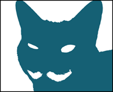

# Fabulous Moustache

## Because Github Auto-name
The auto-name feature is pretty great, and this name is far more clever than anything I could have come up with.
Also I found a cat with a moustache, and now he's the logo icon.

Fabulous Moustache, hereafter referred to as FABSTACHE, is a basic implementation of a Reactive Documents model, editor, and viewer.
Reactive Documents are credited to Bret Victor, outlined here: ( http://worrydream.com/#!/ExplorableExplanations ).  They're pretty neat, like most of the things he designs.

I've wanted my own reactive document system for a while, and am particularly interested in some form of editor to make them accessible to people who are terrified of code.

If you want a more full-featured system, available as a javascript library, check out Bret's own Tangle here : http://worrydream.com/Tangle/download.html